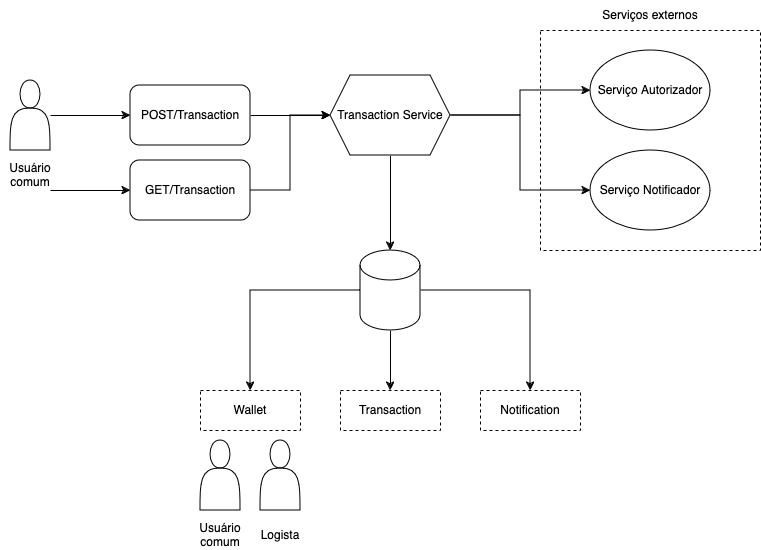

# Micro Picpay Challenge

Este projeto foi desenvolvido através do [víde: Picpay simplificado com Java e Spring Boot!](https://www.youtube.com/watch?v=YcuscoiIN14) da Giuliana Bezerra. 

Ele consiste duas funcionalidades de realizar transações de pagamento entre dois usuários distintos, sendo um do tipo pagador e outro do tipo recebedor.

## Diagrama de arquitetura 
 

 Tem dois endpoints um GET e POST para a entidade *Transaction*.

 Ambos enviam as solicitação a camada service que se conectam com o banco de dados e os serviços externos(autorização e notificação).

 ## Tecnologias utilizadas

     
    
    
    
    

## Aprendizados

## Cobertura de testes
